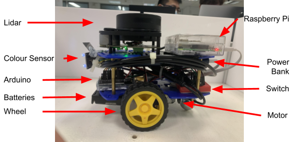

# AlexBot-B02-6A

Alex is a SAR robot that can be remotely controlled. It will be able to aid in accelerating SAR operations through environment mapping and survivor location. The essential functionalities Alex would need to achieve its aim are as follows:

1.  Remote communications:

Alex can be commanded wirelessly by an operator to explore its environment. It can also relay information about the mapped environment and the colour of objects back to the operator.

2.  Environment Mapping:

Alex is able to analyse data received from the LiDAR to map out the environment around it. This map can also help the operator locate survivors.

3.  Movement:

Alex is able to move straight, turn left, turn right and reverse based on the commands given by the operator. The speed of the movement can also be controlled by the operator. With the mapped environment, the operator can identify obstacles and avoid them.

